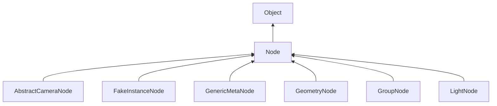

#### Inheritance Graph

## Functions

|
| -----------------------------------------------------------------------------------------------------------------------------------: | -------------------------------------------------------------------------------------------------------------------------------------------------------------------------------------------------------------------------------------------------------------------------------------------------------------------------------------- | 
| **_enableNodeAddedObserver**()                                                                                                       | [ESMF] self MinSG.Node._enableNodeAddedObserver() Adds a ScriptedObserver to the node. This observer calls the Node's script member function 'onNodeAdded' when a node in the subtree is added. \note Make sure that a member of that name exists before moving a node; an exception is thrown otherwise.                  | 
| **_enableNodeRemovedObserver**()                                                                                                     | [ESMF] self MinSG.Node._enableNodeRemovedObserver() Adds a ScriptedObserver to the node. This observer calls the Node's script member function 'onNodeRemoved' when a node in the subtree is added. \note Make sure that a member of that name exists before moving a node; an exception is thrown otherwise.              | 
| **_enableTransformationObserver**()                                                                                                  | [ESMF] self MinSG.Node._enableTransformationObserver() Adds a ScriptedObserver to the node. This observer calls the Node's script member function 'onNodeTransformed' when a node in the subtree is transformed. \note Make sure that a member of that name exists before moving a node; an exception is thrown otherwise. | 
| **[_setPrototype](classMinSG_1_1Node#classMinSG_1_1Node_1aa35f0cea78dc62f8df9631c9e673c3f0)**(p0)                                    | [ESMF] self MinSG.Node._setPrototype( void\|\|MinSG.Node )                                                                                                                                                                                                                                                                             | 
| **[activate](classMinSG_1_1Node#classMinSG_1_1Node_1aa11473d5739ab97dec3202fc9fde2127)**()                                           | [ESMF] self MinSG.Node.activate()                                                                                                                                                                                                                                                                                                      | 
| **[addState](classMinSG_1_1Node#classMinSG_1_1Node_1a1e9b5c27a322a6c525ba84d6db04bcb2)**(p0)                                         | [ESMF] self MinSG.Node.addState(State)                                                                                                                                                                                                                                                                                                 | 
| **[createInstance](classMinSG_1_1Node#classMinSG_1_1Node_1aedf75bdfac152abe16438eeb4b4596d2)**(p0)                                   | [ESF] Node MinSG.Node.createInstance(Node prototype)                                                                                                                                                                                                                                                                                   | 
| **[deactivate](classMinSG_1_1Node#classMinSG_1_1Node_1ac0f3790a68c898a5eec7bd1b610ad320)**()                                         | [ESMF] self MinSG.Node.deactivate()                                                                                                                                                                                                                                                                                                    | 
| **[display](classMinSG_1_1Node#classMinSG_1_1Node_1a1d6696558c7ca0da5927d2add5c09b36)**(p0 [, p1])                                   | [ESMF] self MinSG.Node.display(FrameContext[,Flags\|RenderingParameter]);                                                                                                                                                                                                                                                              | 
| **findNodeAttribute**(p0)                                                                                                            | [ESMF] Object MinSG.Node.findNodeAttribute(string key)                                                                                                                                                                                                                                                                                 | 
| **[getBB](classMinSG_1_1Node#classMinSG_1_1Node_1a3722e65aa3aa5a6ec6bc0ad721a30207)**()                                              | [ESMF] Box MinSG.Node.getBB()                                                                                                                                                                                                                                                                                                          | 
| ~~getMatrix~~()                                                                                                                      | [ESMF] Matrix4x4 MinSG.Node.getMatrix()  **Deprecated**                                                                                                                                                                                                                                                                            | 
| **[getMemoryUsage](classMinSG_1_1Node#classMinSG_1_1Node_1ab1b9d312b3dd5b6a4c55232ada7e26ee)**()                                     | [ESMF] Number MinSG.Node.getMemoryUsage()                                                                                                                                                                                                                                                                                              | 
| **getNodeAttribute**(p0)                                                                                                             | [ESMF] Object MinSG.Node.getNodeAttribute(string key)                                                                                                                                                                                                                                                                                  | 
| **getNodeAttributes**()                                                                                                              | [ESMF] Map MinSG.Node.getNodeAttributes()                                                                                                                                                                                                                                                                                              | 
| **[getParent](classMinSG_1_1Node#classMinSG_1_1Node_1a081746364785ba2a0d330e939efefa44)**()                                          | [ESMF] MinSG.GoupNode Node.getParent()                                                                                                                                                                                                                                                                                                 | 
| **[getPrototype](classMinSG_1_1Node#classMinSG_1_1Node_1ae4f8d2a1e70f0dc70ddd7e0020f1738b)**()                                       | [ESMF] Bool MinSG.Node.getPrototype()                                                                                                                                                                                                                                                                                                  | 
| **[getRelOrigin](classMinSG_1_1Node#classMinSG_1_1Node_1a6d91bc61df566c8381b1473a3fc9745f)**()                                       | [ESMF] Vec3 MinSG.Node.getRelOrigin()                                                                                                                                                                                                                                                                                                  | 
| **getRelPosition**()                                                                                                                 | [ESMF] Vec3 MinSG.Node.getRelPosition()                                                                                                                                                                                                                                                                                                | 
| **[getRelScaling](classMinSG_1_1Node#classMinSG_1_1Node_1a7ed81d89afafb79253f257d3859b68a5)**()                                      | [ESMF] number MinSG.Node.getRelScaling()                                                                                                                                                                                                                                                                                               | 
| **[getRelTransformationMatrix](classMinSG_1_1Node#classMinSG_1_1Node_1a9f8dbb6a28f8ce3e698fedab016fe432)**()                         | [ESMF] Matrix4x4 MinSG.Node.getRelTransformationMatrix()                                                                                                                                                                                                                                                                               | 
| **[getRelTransformationSRT](classMinSG_1_1Node#classMinSG_1_1Node_1a07f072066bba86cdc5d699a87be89cec)**()                            | [ESMF] SRT MinSG.Node.getRelTransformationSRT()                                                                                                                                                                                                                                                                                        | 
| **[getRenderingLayers](classMinSG_1_1Node#classMinSG_1_1Node_1a70c1dc754b39b15d01d3264caba41afe)**()                                 | [ESMF] Number MinSG.Node.getRenderingLayers()	                                                                                                                                                                                                                                                                                         | 
| **getRuntimeId**()                                                                                                                   | [ESMF] String Node.getRuntimeId()                                                                                                                                                                                                                                                                                                      | 
| ~~getSRT~~()                                                                                                                         | [ESMF] SRT MinSG.Node.getSRT()  **Deprecated**                                                                                                                                                                                                                                                                                     | 
| ~~getScale~~()                                                                                                                       | [ESMF] number MinSG.Node.getScale()	 **Deprecated**                                                                                                                                                                                                                                                                                | 
| **[getStates](classMinSG_1_1Node#classMinSG_1_1Node_1a9bafd7519431040bda42e619adee711c)**()                                          | [ESMF] Array MinSG.Node.getStates()                                                                                                                                                                                                                                                                                                    | 
| **[getWorldBB](classMinSG_1_1Node#classMinSG_1_1Node_1a084ccb5514833e166e1c7350105fae1a)**()                                         | [ESMF] Box MinSG.Node.getWorldBB()                                                                                                                                                                                                                                                                                                     | 
| **[getWorldOrigin](classMinSG_1_1Node#classMinSG_1_1Node_1a706c8ae72b2ac61f323c3dbc859a7c8d)**()                                     | [ESMF] Vec3 MinSG.Node.getWorldOrigin()                                                                                                                                                                                                                                                                                                | 
| ~~getWorldPosition~~()                                                                                                               | [ESMF] Vec3 MinSG.Node.getWorldPosition()  **Deprecated**                                                                                                                                                                                                                                                                          | 
| **[getWorldToLocalMatrix](classMinSG_1_1Node#classMinSG_1_1Node_1a8c465a78ec2bb1439757859dfcf5fbb4)**()                              | [ESMF] Matrix4x4 MinSG.Node.getWorldToLocalMatrix()()                                                                                                                                                                                                                                                                                  | 
| **[getWorldTransformationMatrix](classMinSG_1_1Node#classMinSG_1_1Node_1ab4a54d268c5c11aac53fef5c23d8eb83)**()                       | [ESMF] Matrix4x4 MinSG.Node.getWorldTransformationMatrix()                                                                                                                                                                                                                                                                             | 
| **[getWorldTransformationSRT](classMinSG_1_1Node#classMinSG_1_1Node_1aa2060a1fdf24665c6d60b7a8593152ab)**()                          | [ESMF] SRT MinSG.Node.getWorldTransformationSRT()                                                                                                                                                                                                                                                                                      | 
| **[hasFixedBB](classMinSG_1_1Node#classMinSG_1_1Node_1a6350deff6940144450aa1bf21528eff4)**()                                         | [ESMF] Bool MinSG.Node.hasFixedBB()                                                                                                                                                                                                                                                                                                    | 
| ~~hasMatrix~~()                                                                                                                      | [ESMF] Bool MinSG.Node.hasMatrix()  **Deprecated**                                                                                                                                                                                                                                                                                 | 
| **[hasParent](classMinSG_1_1Node#classMinSG_1_1Node_1a939c38aa9508d6a60ff93fc867740970)**()                                          | [ESMF] Bool MinSG.Node.hasParent()                                                                                                                                                                                                                                                                                                     | 
| **[hasRelTransformationSRT](classMinSG_1_1Node#classMinSG_1_1Node_1a79c5acb9ef236e76918602823f2576a1)**()                            | [ESMF] Bool MinSG.Node.hasRelTransformationSRT()                                                                                                                                                                                                                                                                                       | 
| ~~hasSRT~~()                                                                                                                         | [ESMF] Bool MinSG.Node.hasSRT()  **Deprecated**                                                                                                                                                                                                                                                                                    | 
| **[hasStates](classMinSG_1_1Node#classMinSG_1_1Node_1a58c5f5341159c82c264dbce724cdba46)**()                                          | [ESMF] bool MinSG.Node.hasStates()                                                                                                                                                                                                                                                                                                     | 
| **hasTransformation**()                                                                                                              | [ESMF] Bool MinSG.Node.hasTransformation()                                                                                                                                                                                                                                                                                             | 
| **[isActive](classMinSG_1_1Node#classMinSG_1_1Node_1a64007b44440d0cca48261d2923fa79d7)**()                                           | [ESMF] bool MinSG.Node.isActive()                                                                                                                                                                                                                                                                                                      | 
| **[isClosed](classMinSG_1_1Node#classMinSG_1_1Node_1a898544e041c8b46e6d8642f673b095ef)**()                                           | [ESMF] Bool MinSG.Node.isClosed()                                                                                                                                                                                                                                                                                                      | 
| **[isDestroyed](classMinSG_1_1Node#classMinSG_1_1Node_1a75c055feef03c3c3e539ac8a55fb3f86)**()                                        | [ESMF] bool MinSG.Node.isDestroyed()                                                                                                                                                                                                                                                                                                   | 
| **[isInstance](classMinSG_1_1Node#classMinSG_1_1Node_1aa3bf1b3a748360fa725aa3a27920dd1f)**()                                         | [ESMF] Bool MinSG.Node.isInstance()                                                                                                                                                                                                                                                                                                    | 
| **isNodeAttributeSet**(p0)                                                                                                           | [ESMF] self MinSG.Node.isNodeAttributeSet(string key)                                                                                                                                                                                                                                                                                  | 
| **[isTempNode](classMinSG_1_1Node#classMinSG_1_1Node_1a580901042ef5b54fc4cc7b1e77326a0e)**()                                         | [ESMF] Bool MinSG.Node.isTempNode()                                                                                                                                                                                                                                                                                                    | 
| **[isTransformationObserved](classMinSG_1_1Node#classMinSG_1_1Node_1ac50c064ea5a31d0490c816b38a7d3bc1)**()                           | [ESMF] Bool MinSG.Node.isTransformationObserved(Vec3)                                                                                                                                                                                                                                                                                  | 
| **[localDirToRelDir](namespaceMinSG_1_1Transformations#namespaceMinSG_1_1Transformations_1a695b6003a5e9344fab194813aea48cd1)**(p0)   | [ESMF] Vec3 MinSG.Node.localDirToRelDir(Vec3)                                                                                                                                                                                                                                                                                          | 
| **[localDirToWorldDir](namespaceMinSG_1_1Transformations#namespaceMinSG_1_1Transformations_1afa46a596d9ca12fab02f96472edf1e92)**(p0) | [ESMF] Vec3 MinSG.Node.localDirToWorldDir(Vec3)                                                                                                                                                                                                                                                                                        | 
| **[localPosToRelPos](namespaceMinSG_1_1Transformations#namespaceMinSG_1_1Transformations_1aa34a09d72dc08bdca05c8053ac2f0a77)**(p0)   | [ESMF] Vec3 MinSG.Node.localPosToRelPos(Vec3)                                                                                                                                                                                                                                                                                          | 
| **[localPosToWorldPos](namespaceMinSG_1_1Transformations#namespaceMinSG_1_1Transformations_1a97da44fea11e89a079f20e1a93b861ce)**(p0) | [ESMF] Vec3 MinSG.Node.localPosToWorldPos(Vec3)                                                                                                                                                                                                                                                                                        | 
| **[moveLocal](classMinSG_1_1Node#classMinSG_1_1Node_1a3704f364c7d26a5aee9ee3436c81af76)**(p0 [, p1 [, p2]])                          | [ESMF] self MinSG.Node.moveLocal(Vec3 \| (x,y,z))                                                                                                                                                                                                                                                                                      | 
| **[moveRel](classMinSG_1_1Node#classMinSG_1_1Node_1a7fc38fcb54175b2921da39ef38465477)**(p0 [, p1 [, p2]])                            | [ESMF] self MinSG.Node.moveRel(Vec3 \| (x,y,z))                                                                                                                                                                                                                                                                                        | 
| **[relDirToLocalDir](namespaceMinSG_1_1Transformations#namespaceMinSG_1_1Transformations_1ad5918ef96fb5416581721cf6d2835f4a)**(p0)   | [ESMF] Vec3 MinSG.Node.relDirToLocalDir(Vec3)                                                                                                                                                                                                                                                                                          | 
| **[relDirToWorldDir](namespaceMinSG_1_1Transformations#namespaceMinSG_1_1Transformations_1a7a71118adbe983a5446c1f31f8d06e6e)**(p0)   | [ESMF] Vec3 MinSG.Node.relDirToWorldDir(Vec3)                                                                                                                                                                                                                                                                                          | 
| **[relPosToLocalPos](namespaceMinSG_1_1Transformations#namespaceMinSG_1_1Transformations_1a47232ff92fcfd2e3c60be9df12dfb0f7)**(p0)   | [ESMF] Vec3 MinSG.Node.relPosToLocalPos(Vec3)                                                                                                                                                                                                                                                                                          | 
| **[relPosToWorldPos](namespaceMinSG_1_1Transformations#namespaceMinSG_1_1Transformations_1ac32158521f1219af7b5736326699ed93)**(p0)   | [ESMF] Vec3 MinSG.Node.relPosToWorldPos(Vec3)                                                                                                                                                                                                                                                                                          | 
| **[removeFixedBB](classMinSG_1_1Node#classMinSG_1_1Node_1a37f6568c3f746193fd0fd0bc2f3e665b)**()                                      | [ESMF] self MinSG.Node.removeFixedBB(Box)                                                                                                                                                                                                                                                                                              | 
| **removeNodeAttributes**()                                                                                                           | [ESMF] self MinSG.Node.removeNodeAttributes()                                                                                                                                                                                                                                                                                          | 
| **[removeState](classMinSG_1_1Node#classMinSG_1_1Node_1aa6d716cb1a9170aa003c7939111f6210)**(p0)                                      | [ESMF] self MinSG.Node.removeState(State)                                                                                                                                                                                                                                                                                              | 
| **[removeStates](classMinSG_1_1Node#classMinSG_1_1Node_1a566a735f97ec6376ea01c7e1ef89e2a9)**()                                       | [ESMF] self MinSG.Node.removeStates()                                                                                                                                                                                                                                                                                                  | 
| ~~reset~~()                                                                                                                          | [ESMF] self MinSG.Node.reset()  **Deprecated**                                                                                                                                                                                                                                                                                     | 
| **[resetRelTransformation](classMinSG_1_1Node#classMinSG_1_1Node_1ad5abb99432208b16edd09047a9b136c0)**()                             | [ESMF] self MinSG.Node.resetRelTransformation()                                                                                                                                                                                                                                                                                        | 
| **rotateAroundLocalAxis_deg**(p0, p1)                                                                                                | [ESMF] self MinSG.Node.rotateAroundLocalAxis_deg(Number,Line3)                                                                                                                                                                                                                                                                         | 
| **rotateAroundLocalAxis_rad**(p0, p1)                                                                                                | [ESMF] self MinSG.Node.rotateAroundLocalAxis_rad(Number,Line3)                                                                                                                                                                                                                                                                         | 
| **rotateAroundRelAxis_deg**(p0, p1)                                                                                                  | [ESMF] self MinSG.Node.rotateAroundRelAxis_deg(Number,Line3)                                                                                                                                                                                                                                                                           | 
| **rotateAroundRelAxis_rad**(p0, p1)                                                                                                  | [ESMF] self MinSG.Node.rotateAroundRelAxis_rad(Number,Line3)                                                                                                                                                                                                                                                                           | 
| **rotateAroundWorldAxis_deg**(p0, p1)                                                                                                | [ESMF] self MinSG.Node.rotateAroundWorldAxis_deg(Number,Line3)                                                                                                                                                                                                                                                                         | 
| **rotateAroundWorldAxis_rad**(p0, p1)                                                                                                | [ESMF] self MinSG.Node.rotateAroundWorldAxis_rad(Number,Line3)                                                                                                                                                                                                                                                                         | 
| **rotateLocal_deg**(p0, p1 [, p2 [, p3]])                                                                                            | [ESMF] self MinSG.Node.rotateLocal_deg(float deg, (Vec3\|x,y,z))                                                                                                                                                                                                                                                                       | 
| **rotateLocal_rad**(p0, p1 [, p2 [, p3]])                                                                                            | [ESMF] self MinSG.Node.rotateLocal_rad(float angle, (Vec3\|x,y,z))                                                                                                                                                                                                                                                                     | 
| **rotateRel_deg**(p0, p1 [, p2 [, p3]])                                                                                              | [ESMF] self MinSG.Node.rotateRel_deg(float deg, (Vec3\|x,y,z))                                                                                                                                                                                                                                                                         | 
| **rotateRel_rad**(p0, p1 [, p2 [, p3]])                                                                                              | [ESMF] self MinSG.Node.rotateRel_rad(float angle, (Vec3\|x,y,z))                                                                                                                                                                                                                                                                       | 
| **[rotateToWorldDir](namespaceMinSG_1_1Transformations#namespaceMinSG_1_1Transformations_1aa00b8d06e76e321376702883bf439ebc)**(p0)   | [ESMF] self MinSG.Node.rotateToWorldDir(Vec3 dir)                                                                                                                                                                                                                                                                                      | 
| **[scale](classMinSG_1_1Node#classMinSG_1_1Node_1afdda915e662c22f508533f9cd2822689)**(p0)                                            | [ESMF] self MinSG.Node.scale(number)                                                                                                                                                                                                                                                                                                   | 
| **[setClosed](classMinSG_1_1Node#classMinSG_1_1Node_1ab7a5a243d3f9ab56582a00f546ee2983)**(p0)                                        | [ESMF] self MinSG.Node.setClosed(bool active)                                                                                                                                                                                                                                                                                          | 
| **[setFixedBB](classMinSG_1_1Node#classMinSG_1_1Node_1a2d5909ebdadd0223d90d4bfccf66abd7)**(p0)                                       | [ESMF] self MinSG.Node.setFixedBB(Box)                                                                                                                                                                                                                                                                                                 | 
| ~~setMatrix~~(p0)                                                                                                                    | [ESMF] self MinSG.Node.setMatrix(Matrix4x4)  **Deprecated**                                                                                                                                                                                                                                                                        | 
| **setNodeAttribute**(p0, p1)                                                                                                         | [ESMF] self MinSG.Node.setNodeAttribute(string key,value)                                                                                                                                                                                                                                                                              | 
| **[setRelOrigin](classMinSG_1_1Node#classMinSG_1_1Node_1a30399b62e73814cae20d8ba5c51a1ba2)**(p0)                                     | [ESMF] self MinSG.Node.setRelOrigin(Vec3)                                                                                                                                                                                                                                                                                              | 
| **setRelPosition**(p0)                                                                                                               | [ESMF] self MinSG.Node.setRelPosition(Vec3)                                                                                                                                                                                                                                                                                            | 
| **[setRelRotation](classMinSG_1_1Node#classMinSG_1_1Node_1afddc50c71f79ae3ae1dc087b3ed65aef)**(p0, p1)                               | [ESMF] self MinSG.Node.setRelRotation(Vec3 dir,Vec3 up)                                                                                                                                                                                                                                                                                | 
| ~~setRelRotation_deg~~(p0, p1 [, p2 [, p3]])                                                                                         | [ESMF] self MinSG.Node.setRelRotation_deg(float deg, (Vec3\|x,y,z))  **Deprecated**                                                                                                                                                                                                                                                | 
| ~~setRelRotation_rad~~(p0, p1 [, p2 [, p3]])                                                                                         | [ESMF] self MinSG.Node.setRelRotation_rad(float angle, (Vec3\|x,y,z))  **Deprecated**                                                                                                                                                                                                                                              | 
| **[setRelScaling](classMinSG_1_1Node#classMinSG_1_1Node_1a268f6518b5fd89adec0ee2ce55cde7f7)**(p0)                                    | [ESMF] self MinSG.Node.setRelScaling(number)                                                                                                                                                                                                                                                                                           | 
| **[setRelTransformation](classMinSG_1_1Node#classMinSG_1_1Node_1a847b2fc7ce4691a6f5ddc2e5d1b22e37)**(p0)                             | [ESMF] self MinSG.Node.setRelTransformation(Matrix4x4\|SRT)                                                                                                                                                                                                                                                                            | 
| **[setRenderingLayers](classMinSG_1_1Node#classMinSG_1_1Node_1a1f6c3690399250ab873ce230b04534a4)**(p0)                               | [ESMF] thisEObj MinSG.Node.setRenderingLayers(Number)                                                                                                                                                                                                                                                                                  | 
| ~~setSRT~~(p0)                                                                                                                       | [ESMF] self MinSG.Node.setSRT(SRT)  **Deprecated**                                                                                                                                                                                                                                                                                 | 
| ~~setScale~~(p0)                                                                                                                     | [ESMF] self MinSG.Node.setScale(number)  **Deprecated**                                                                                                                                                                                                                                                                            | 
| **[setTempNode](classMinSG_1_1Node#classMinSG_1_1Node_1a710dd9e050c7be422247b3a69ef8378c)**(p0)                                      | [ESMF] self MinSG.Node.setTempNode(bool)                                                                                                                                                                                                                                                                                               | 
| **[setWorldOrigin](classMinSG_1_1Node#classMinSG_1_1Node_1a5dc4f9fb8c59b91dd8e422b30c8548f2)**(p0)                                   | [ESMF] self MinSG.Node.setWorldOrigin(Vec3)                                                                                                                                                                                                                                                                                            | 
| ~~setWorldPosition~~(p0)                                                                                                             | [ESMF] self MinSG.Node.setWorldPosition(Vec3)  **Deprecated**                                                                                                                                                                                                                                                                      | 
| **[setWorldTransformation](classMinSG_1_1Node#classMinSG_1_1Node_1a02a90c67aca2ed0041d11ff472d58c90)**(p0)                           | [ESMF] slef MinSG.Node.setWorldTransformation(SRT)                                                                                                                                                                                                                                                                                     | 
| **[testRenderingLayer](classMinSG_1_1Node#classMinSG_1_1Node_1ace899f0773d1a53f9780ba6ee9ebac47)**(p0)                               | [ESMF] bool MinSG.Node.testRenderingLayer(Number)                                                                                                                                                                                                                                                                                      | 
| **unsetNodeAttribute**(p0)                                                                                                           | [ESMF] bool MinSG.Node.unsetNodeAttribute(string key)                                                                                                                                                                                                                                                                                  | 
| **[worldDirToLocalDir](namespaceMinSG_1_1Transformations#namespaceMinSG_1_1Transformations_1a09ed5a2f09a3ca21b888f25dbabbba9f)**(p0) | [ESMF] Vec3 MinSG.Node.worldDirToLocalDir(Vec3)                                                                                                                                                                                                                                                                                        | 
| **[worldDirToRelDir](namespaceMinSG_1_1Transformations#namespaceMinSG_1_1Transformations_1a03824de63cce1da08a198c10c2171e80)**(p0)   | [ESMF] Vec3 MinSG.Node.worldDirToRelDir(Vec3)                                                                                                                                                                                                                                                                                          | 
| **[worldPosToLocalPos](namespaceMinSG_1_1Transformations#namespaceMinSG_1_1Transformations_1a00753571c7420dc896a7b22001697afe)**(p0) | [ESMF] Vec3 MinSG.Node.worldPosToLocalPos(Vec3)                                                                                                                                                                                                                                                                                        | 
| **[worldPosToRelPos](namespaceMinSG_1_1Transformations#namespaceMinSG_1_1Transformations_1acb59b9947778d194587e13b4f2ac6797)**(p0)   | [ESMF] Vec3 MinSG.Node.worldPosToRelPos(Vec3)                                                                                                                                                                                                                                                                                          | 
{: .nohead .nowrap1 }

