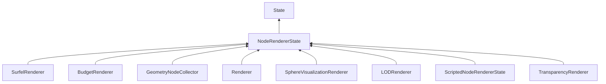

#### Inheritance Graph

## Functions

|
| -----------------------------------------------------------------------------------------------------------------------------: | ----------------------------------------------------------- | 
| **[getSourceChannel](classMinSG_1_1NodeRendererState#classMinSG_1_1NodeRendererState_1a198cddabde3871f806c564ab0bc22539)**()   | [ESF] String E_NodeRendererState.getSourceChannel()         | 
| **[setSourceChannel](classMinSG_1_1NodeRendererState#classMinSG_1_1NodeRendererState_1a6a76a00ff520bd270c48e3c37e000dd0)**(p0) | [ESF] thisEObj E_NodeRendererState.setSourceChannel(String) | 
{: .nohead .nowrap1 }

