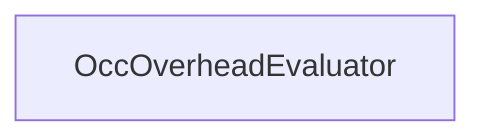

#### Inheritance Graph

## Functions

|
| ---------------------: | ----------------------------------------------------- | 
| **_constructor**([p0]) | [ESMF] new MinSG.OccOverheadEvaluator( [direction] )	 | 
{: .nohead .nowrap1 }

