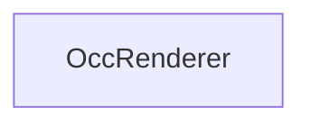

#### Inheritance Graph

## Attributes

|
| ---------------------: | -- | 
| **MODE_CULLING**       |  | 
| **MODE_OPT_CULLING**   |  | 
| **MODE_SHOW_CULLED**   |  | 
| **MODE_SHOW_VISIBLE**  |  | 
| **MODE_UNCONDITIONED** |  | 
{: .nohead .nowrap1 }

## Functions

|
| --------------------------------------------------------------------------------------------------------: | -------------------------------- | 
| **_constructor**()                                                                                        | [ESMF] new MinSG.OccRenderer     | 
| **[getMode](classMinSG_1_1OccRenderer#classMinSG_1_1OccRenderer_1a6aa6f585efcefd4b9b3c7aa98bad17a1)**()   | [ESMF] enum MinSG.getMode()	     | 
| **[setMode](classMinSG_1_1OccRenderer#classMinSG_1_1OccRenderer_1a0117951ff2e1c54b2e5c3d7dda4d6fb0)**(p0) | [ESMF] self MinSG.setMode(mode)	 | 
{: .nohead .nowrap1 }

