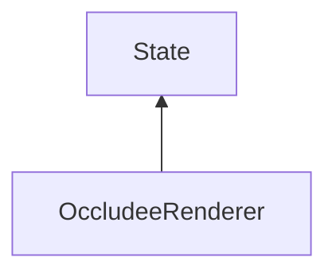

#### Inheritance Graph

## Functions

|
| --------------------------------------------------------------------------------------------------------------------------: | --------------------------------------------- | 
| **_constructor**()                                                                                                          | [ESF] OccludeeRenderer new OccludeeRenderer() | 
| **[getShowOriginal](classMinSG_1_1OccludeeRenderer#classMinSG_1_1OccludeeRenderer_1a2ebfe7edb00906a82043e0d35f31e176)**()   | [ESMF] bool MinSG.getShowOriginal()	          | 
| **[getUseWireframe](classMinSG_1_1OccludeeRenderer#classMinSG_1_1OccludeeRenderer_1a458c69082de2ea71db1712a1134a25d6)**()   | [ESMF] bool MinSG.getUseWireframe()	          | 
| **[setShowOriginal](classMinSG_1_1OccludeeRenderer#classMinSG_1_1OccludeeRenderer_1a38d22c999fd9196d0ee24584ad1a893b)**(p0) | [ESMF] self MinSG.setShowOriginal(bool)	      | 
| **[setUseWireframe](classMinSG_1_1OccludeeRenderer#classMinSG_1_1OccludeeRenderer_1a4c8028fd85df5b72c1de20b64099c38d)**(p0) | [ESMF] self MinSG.setUseWireframe(bool)	      | 
{: .nohead .nowrap1 }

