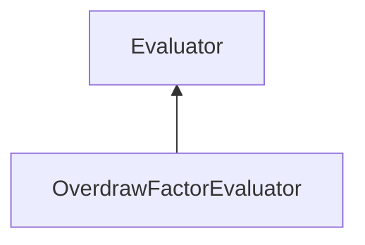

#### Inheritance Graph

## Functions

|
| -----------------------------------------------------------------------------------------------------------------------------------------------------------------------: | ---------------------------------------------------------------- | 
| **_constructor**([p0])                                                                                                                                                   | [ESF] Evaluator new OverdrawFactorEvaluator([mode=SINGLE_VALUE]) | 
| **[areZeroValuesIgnored](classMinSG_1_1Evaluators_1_1OverdrawFactorEvaluator#classMinSG_1_1Evaluators_1_1OverdrawFactorEvaluator_1a359aabb714af5e4a3a48738967172efe)**() | [ESMF] Bool OverdrawFactorEvaluator.areZeroValuesIgnored()       | 
| **[getResultQuantile](classMinSG_1_1Evaluators_1_1OverdrawFactorEvaluator#classMinSG_1_1Evaluators_1_1OverdrawFactorEvaluator_1a6527cac79e2b963171cb2a2fcef0f6f3)**()    | [ESMF] Number OverdrawFactorEvaluator.getResultQuantile()        | 
| **[ignoreZeroValues](classMinSG_1_1Evaluators_1_1OverdrawFactorEvaluator#classMinSG_1_1Evaluators_1_1OverdrawFactorEvaluator_1a42f25231c22a2c1f03652fee54484f99)**()     | [ESMF] self OverdrawFactorEvaluator.ignoreZeroValues()           | 
| **[keepZeroValues](classMinSG_1_1Evaluators_1_1OverdrawFactorEvaluator#classMinSG_1_1Evaluators_1_1OverdrawFactorEvaluator_1ad0947405db3a7c2c6d37cf62dc3160f8)**()       | [ESMF] self OverdrawFactorEvaluator.keepZeroValues()             | 
| **[setResultQuantile](classMinSG_1_1Evaluators_1_1OverdrawFactorEvaluator#classMinSG_1_1Evaluators_1_1OverdrawFactorEvaluator_1a8d32e25d529dc3a94f543fe069d3bfd0)**(p0)  | [ESMF] self OverdrawFactorEvaluator.setResultQuantile(Number)    | 
{: .nohead .nowrap1 }

