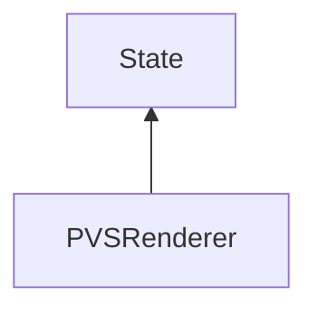

#### Inheritance Graph

## Functions

|
| ---------------------------------------------------------------------------------------------------------------------------------------------------------------: | ---------------------------------------------------------- | 
| **_constructor**()                                                                                                                                               | [ESMF] PVSRenderer new PVSRenderer()                       | 
| **[setViewCells](classMinSG_1_1VisibilitySubdivision_1_1PVSRenderer#classMinSG_1_1VisibilitySubdivision_1_1PVSRenderer_1ad90a7c45b8b81fa484e6f1a24ece7c3b)**(p0) | [ESMF] self PVSRenderer.setViewCells(E_ValuatedRegionNode) | 
{: .nohead .nowrap1 }

