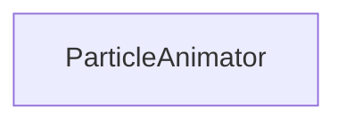

#### Inheritance Graph

## Functions

|
| -------------------: | --------------------------------------------------- | 
| **_constructor**(p0) | [ESMF] new MinSG.ParticleAnimator( particleSystem ) | 
{: .nohead .nowrap1 }

