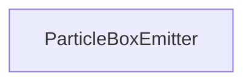

#### Inheritance Graph

## Functions

|
| ----------------------------------------------------------------------------------------------------------------------------: | ------------------------------------------------------- | 
| **_constructor**(p0)                                                                                                          | [ESMF] new MinSG.ParticleBoxEmitter( particleSystem )	  | 
| **[getEmitBounds](classMinSG_1_1ParticleBoxEmitter#classMinSG_1_1ParticleBoxEmitter_1aebd8b40bb97ff91450cd17f13094f684)**()   | [ESMF] Box MinSG.ParticleBoxEmitter.getDirection()      | 
| **[setEmitBounds](classMinSG_1_1ParticleBoxEmitter#classMinSG_1_1ParticleBoxEmitter_1af979efe2e0c8f0d84c218b656c6011f8)**(p0) | [ESMF] self MinSG.ParticleBoxEmitter.setDirection(Box)	 | 
{: .nohead .nowrap1 }

