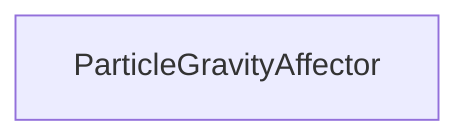

#### Inheritance Graph

## Functions

|
| -----------------------------------------------------------------------------------------------------------------------------------: | ----------------------------------------------------------- | 
| **_constructor**(p0)                                                                                                                 | [ESMF] new MinSG.ParticleGravityAffector( particleSystem )	 | 
| **[getGravity](classMinSG_1_1ParticleGravityAffector#classMinSG_1_1ParticleGravityAffector_1ad932d7b4c29fd138cfd7f8790362cd50)**()   | [ESMF] Vec3 MinSG.ParticleEmitter.getDirection()	           | 
| **[setGravity](classMinSG_1_1ParticleGravityAffector#classMinSG_1_1ParticleGravityAffector_1a558bbebce6a00e9b380876b06a3e5fe2)**(p0) | [ESMF] self MinSG.ParticleEmitter.setDirection(Vec3)	       | 
{: .nohead .nowrap1 }

