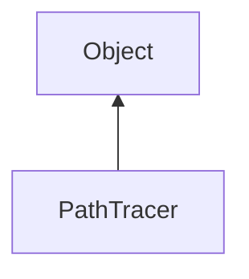

#### Inheritance Graph

## Functions

|
| ----------------------------------------------------------------------------------------------------------------------------------------------: | -------------------------------------------------------------- | 
| **_constructor**()                                                                                                                              | [ESMF] PathTracer new PathTracer()                             | 
| **[download](classMinSG_1_1PathTracing_1_1PathTracer#classMinSG_1_1PathTracing_1_1PathTracer_1a5ccdaa3f12b8088a8e908ae180039726)**(p0 [, p1])   | [ESMF] self PathTracer.download(image)                         | 
| **[getSamplesPerPixel](classMinSG_1_1PathTracing_1_1PathTracer#classMinSG_1_1PathTracing_1_1PathTracer_1a5e39b5e1ed46e61d8501daee16455679)**()  | [ESMF] Number PathTracer.getSamplesPerPixel()                  | 
| **[isFinished](classMinSG_1_1PathTracing_1_1PathTracer#classMinSG_1_1PathTracing_1_1PathTracer_1a30671df35f665bef5b7b11e6a17d77e6)**()          | [ESMF] Bool PathTracer.isFinished()                            | 
| **[pause](classMinSG_1_1PathTracing_1_1PathTracer#classMinSG_1_1PathTracing_1_1PathTracer_1a2b1b98fa7dc59febf787d118ec4e6121)**()               | [ESMF] self PathTracer.pause()                                 | 
| **[reset](classMinSG_1_1PathTracing_1_1PathTracer#classMinSG_1_1PathTracing_1_1PathTracer_1a7a265b62e2209b59bae9adcecfeff9d6)**()               | [ESMF] self PathTracer.reset()                                 | 
| **[setAntiAliasing](classMinSG_1_1PathTracing_1_1PathTracer#classMinSG_1_1PathTracing_1_1PathTracer_1ad7ff6154e0c985dedd6377e0dc65cc09)**(p0)   | [ESMF] self PathTracer.setAntiAliasing(Bool antiAliasing)      | 
| **[setCamera](classMinSG_1_1PathTracing_1_1PathTracer#classMinSG_1_1PathTracing_1_1PathTracer_1ab1af41b3a4119a429ec3c629ad1922d1)**(p0)         | [ESMF] self PathTracer.setCamera(AbstractCameraNode camera)    | 
| **[setMaxBounces](classMinSG_1_1PathTracing_1_1PathTracer#classMinSG_1_1PathTracing_1_1PathTracer_1af48d1c6496512514b0a3c491ae09e408)**(p0)     | [ESMF] self PathTracer.setMaxBounces(Number maxBounces)        | 
| **[setMaxSamples](classMinSG_1_1PathTracing_1_1PathTracer#classMinSG_1_1PathTracing_1_1PathTracer_1adf84f9df7145ca08d3b3781196cc9a89)**(p0)     | [ESMF] self PathTracer.setMaxSamples(Number maxSamples)        | 
| **[setResolution](classMinSG_1_1PathTracing_1_1PathTracer#classMinSG_1_1PathTracing_1_1PathTracer_1af92c6226094755a21c3ffcb7cf1bc61f)**(p0)     | [ESMF] self PathTracer.setResolution(Geometry.Vec2 resolution) | 
| **[setScene](classMinSG_1_1PathTracing_1_1PathTracer#classMinSG_1_1PathTracing_1_1PathTracer_1a8d98b816f40a54509369cdf4d83b8f2f)**(p0)          | [ESMF] self PathTracer.setScene(GroupNode scene)               | 
| **[setSeed](classMinSG_1_1PathTracing_1_1PathTracer#classMinSG_1_1PathTracing_1_1PathTracer_1a4c374cb9c810ac59eec8482cf79dbb1b)**(p0)           | [ESMF] self PathTracer.setSeed(Number seed)                    | 
| **[setThreadCount](classMinSG_1_1PathTracing_1_1PathTracer#classMinSG_1_1PathTracing_1_1PathTracer_1a63bfe86832ba9aa04480e0d0b0cc9899)**(p0)    | [ESMF] self PathTracer.setThreadCount(Number count)            | 
| **[setTileSize](classMinSG_1_1PathTracing_1_1PathTracer#classMinSG_1_1PathTracing_1_1PathTracer_1afa26d6d7d89609bfd20c9d2a47318f29)**(p0)       | [ESMF] self PathTracer.setTileSize(Number size)                | 
| **[setUseGlobalLight](classMinSG_1_1PathTracing_1_1PathTracer#classMinSG_1_1PathTracing_1_1PathTracer_1a793561a07b9b94f5cc4e7ff79d471896)**(p0) | [ESMF] self PathTracer.setUseGlobalLight(Bool useGlobalLight)  | 
| **[start](classMinSG_1_1PathTracing_1_1PathTracer#classMinSG_1_1PathTracing_1_1PathTracer_1ad28236db1194a23707057ffde1fd168e)**()               | [ESMF] self PathTracer.start()                                 | 
{: .nohead .nowrap1 }

