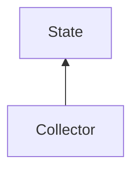

#### Inheritance Graph

## Functions

|
| -----------------: | ---------------------------------------------- | 
| **_constructor**() | [ESF] new MinSG.PipelineStatistics.Collector() | 
{: .nohead .nowrap1 }

