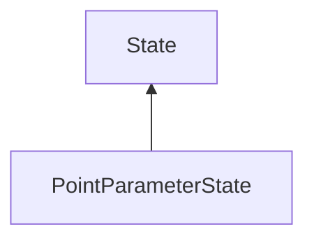

#### Inheritance Graph

## Functions

|
| ----------------------------------------------------------------------------------------------------------------------------------------: | ---------------------------------------------------------------------------- | 
| **_constructor**()                                                                                                                        | [ESF] PointParameterState new PointParameterState()                          | 
| **[getParameters](classMinSG_1_1RenderingParametersState#classMinSG_1_1RenderingParametersState_1abc0891cd567b279a86f85f978452b010)**()   | [ESMF] Rendering.PointParameters PointParameterState.getParameters()         | 
| **[getSize](classRendering_1_1PointParameters#classRendering_1_1PointParameters_1a433aa4c541380e1ab018b8c7b6597fa6)**()                   | [ESMF] Number PointParameterState.getPointSize()                             | 
| **[isPointSmoothingEnabled](classRendering_1_1PointParameters#classRendering_1_1PointParameters_1ac6905d72ee98d9722a5f3d2f47737ea6)**()   | [ESMF] Bool PointParameterState.isPointSmoothingEnabled()                    | 
| **[setParameters](classMinSG_1_1RenderingParametersState#classMinSG_1_1RenderingParametersState_1a4e9f8bfdd58c370bb046aef0945335c4)**(p0) | [ESMF] thisEObj PointParameterState.setParameters(Rendering.PointParameters) | 
| **setPointSmoothingEnabled**(p0)                                                                                                          | [ESMF] thisEObj PointParameterState.setPointSmoothingEnabled(Bool)           | 
| **[setSize](classRendering_1_1PointParameters#classRendering_1_1PointParameters_1a6075bc70da4a0b2314a0ca1aa6f390dd)**(p0)                 | [ESMF] thisEObj PointParameterState.setSize(Number)                          | 
{: .nohead .nowrap1 }

