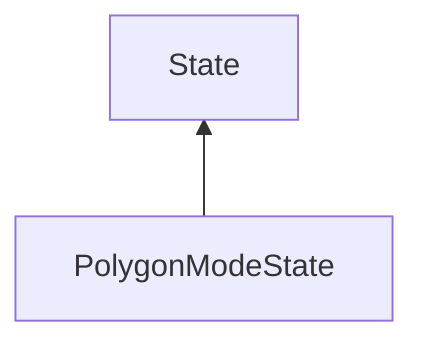

#### Inheritance Graph

## Functions

|
| ----------------------------------------------------------------------------------------------------------------------------------------: | ------------------------------------------------------------------------------- | 
| **_constructor**()                                                                                                                        | [ESF] PolygonModeState new PolygonModeState()                                   | 
| **[getMode](classRendering_1_1PolygonModeParameters#classRendering_1_1PolygonModeParameters_1a0979cb2f20640496d8fbe18fbe15f3c0)**()       | [ESMF] Number PolygonModeState.getMode()                                        | 
| **[getParameters](classMinSG_1_1RenderingParametersState#classMinSG_1_1RenderingParametersState_1abc0891cd567b279a86f85f978452b010)**()   | [ESMF] Rendering.PolygonModeParameters PolygonModeState.getParameters()         | 
| **[setMode](classRendering_1_1PolygonModeParameters#classRendering_1_1PolygonModeParameters_1aed558ef584d0f0997f1502fb732fb4f1)**(p0)     | [ESMF] thisEObj PolygonModeState.setMode(Number)                                | 
| **[setParameters](classMinSG_1_1RenderingParametersState#classMinSG_1_1RenderingParametersState_1a4e9f8bfdd58c370bb046aef0945335c4)**(p0) | [ESMF] thisEObj PolygonModeState.setParameters(Rendering.PolygonModeParameters) | 
{: .nohead .nowrap1 }

