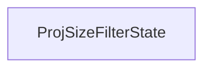

#### Inheritance Graph

## Functions

|
| -----------------------------------------------------------------------------------------------------------------------------------: | --------------------------------------------------------- | 
| **_constructor**()                                                                                                                   | [ESF] new MinSG.ProjSizeFilterState()\*/                  | 
| **[getMaximumProjSize](classMinSG_1_1ProjSizeFilterState#classMinSG_1_1ProjSizeFilterState_1a240f1c1bf4554bf5543547985c1da095)**()   | [ESMF] Number projSizeFilterState.getMaximumProjSize()    | 
| **[getMinimumDistance](classMinSG_1_1ProjSizeFilterState#classMinSG_1_1ProjSizeFilterState_1a80bbb15606d98719e348176399ee0349)**()   | [ESMF] Number projSizeFilterState.getMinimumDistance()    | 
| **[getTargetChannel](classMinSG_1_1ProjSizeFilterState#classMinSG_1_1ProjSizeFilterState_1a3bbebf98731fd778b8bdd6c2c83bafe2)**()     | [ESMF] String projSizeFilterState.getTargetChannel()      | 
| **[isForceClosed](classMinSG_1_1ProjSizeFilterState#classMinSG_1_1ProjSizeFilterState_1a607a2eac6572225c972f8c68b6610c78)**()        | [ESMF] Bool projSizeFilterState.isForced()                | 
| **[setForceClosed](classMinSG_1_1ProjSizeFilterState#classMinSG_1_1ProjSizeFilterState_1acf747a8d6b36c43fbdf5a1551e434c60)**(p0)     | [ESMF] self projSizeFilterState.setForced(bool)           | 
| **[setMaximumProjSize](classMinSG_1_1ProjSizeFilterState#classMinSG_1_1ProjSizeFilterState_1ae4e395fc1932b610848c5e4ddc7e347c)**(p0) | [ESMF] self projSizeFilterState.setMaximumProjSize(float) | 
| **[setMinimumDistance](classMinSG_1_1ProjSizeFilterState#classMinSG_1_1ProjSizeFilterState_1a5dfd291ceb41787079f9f4b33ad12a90)**(p0) | [ESMF] self projSizeFilterState.setMinimumDistance(float) | 
| **[setTargetChannel](classMinSG_1_1ProjSizeFilterState#classMinSG_1_1ProjSizeFilterState_1ac502343013170a4157d23337cea45494)**(p0)   | [ESMF] self projSizeFilterState.setTargetChannel(string)  | 
{: .nohead .nowrap1 }

