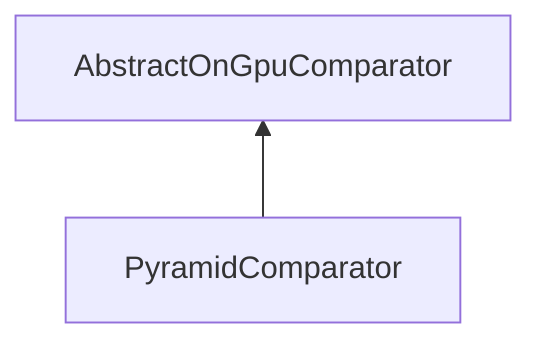

#### Inheritance Graph

## Functions

|
| ------------------------------------------------------------------------------------------------------------------------------------------------------------------: | ---------------------------------------------------------------------------- | 
| **_constructor**()                                                                                                                                                  | [ESF] PyramidComparator new PyramidComparator()                              | 
| **[getInternalComparator](classMinSG_1_1ImageCompare_1_1PyramidComparator#classMinSG_1_1ImageCompare_1_1PyramidComparator_1a65734ba68a37ab89dd30d6567164fa99)**()   |                                                                              | 
| **[getMinimalTestSize](classMinSG_1_1ImageCompare_1_1PyramidComparator#classMinSG_1_1ImageCompare_1_1PyramidComparator_1a9ad421cdd03129277c856318611a30fe)**()      | [ESMF] Number PyramidComparator.getMinimalTestSize()                         | 
| **[setInternalComparator](classMinSG_1_1ImageCompare_1_1PyramidComparator#classMinSG_1_1ImageCompare_1_1PyramidComparator_1a6365985430f9ff79126b1414d067a307)**(p0) | [ESMF] void PyramidComparator.setInternalComparator(AbstractOnGpuComparator) | 
| **[setMinimalTestSize](classMinSG_1_1ImageCompare_1_1PyramidComparator#classMinSG_1_1ImageCompare_1_1PyramidComparator_1a316fae79f1b21fc2bbcd560b63c8df5b)**(p0)    | [ESMF] void PyramidComparator.setMinimalTestSize(Number sideLength)          | 
{: .nohead .nowrap1 }

