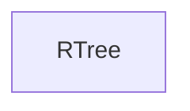

#### Inheritance Graph

## Functions

|
| -----------------------: | ----------------------------------------------- | 
| **_constructor**(p0, p1) | [ESMF] new MinSG.RTree(minEntries, maxEntries)	 | 
{: .nohead .nowrap1 }

