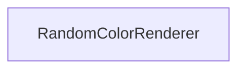

#### Inheritance Graph

## Description

[E_RandomColorRenderer] ---\|> [E_State] ---\|> [E_GroupNode] ---\|> [E_Node]

## Functions

|
| -----------------: | ------------------------------------ | 
| **_constructor**() | [ESMF] new MinSG.VisibilityEvaluator | 
{: .nohead .nowrap1 }

