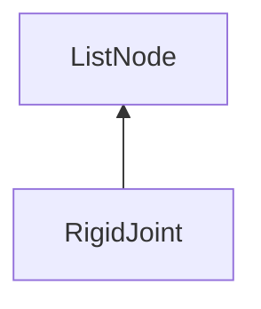

#### Inheritance Graph

## Functions

|
| ------------------------------------------------------------------------------------------------------------: | ------------------------------------------- | 
| **_constructor**(p0, p1)                                                                                      | [ESMF] new MinSG.RigidJoint(Number,String)	 | 
| **[setOffsetMatrix](classMinSG_1_1RigidJoint#classMinSG_1_1RigidJoint_1a83ecfc251d957508e30e613dd82267df)**() |                                             | 
{: .nohead .nowrap1 }

