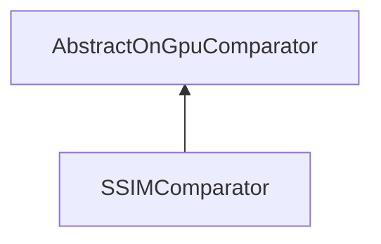

#### Inheritance Graph

## Functions

|
| -----------------: | ----------------------------------------- | 
| **_constructor**() | [ESF] SSIMComparator new SSIMComparator() | 
{: .nohead .nowrap1 }

