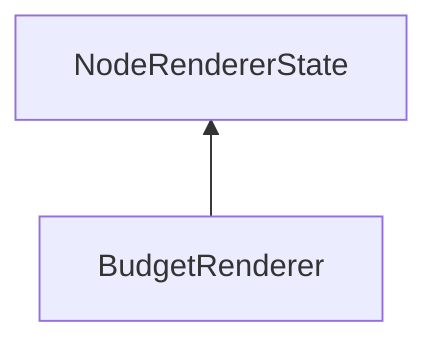

#### Inheritance Graph

## Functions

|
| ------------------------------------------------------------------------------------------------------------------------------: | -------------------------------------------- | 
| **_constructor**()                                                                                                              | [ESF] new MinSG.SVS.BudgetRenderer()         | 
| **[getBudget](classMinSG_1_1SVS_1_1BudgetRenderer#classMinSG_1_1SVS_1_1BudgetRenderer_1a3f4973bec86c363e0dd989b4a554129f)**()   | [ESMF] Number BudgetRenderer.getBudget()     | 
| **[setBudget](classMinSG_1_1SVS_1_1BudgetRenderer#classMinSG_1_1SVS_1_1BudgetRenderer_1a9bea4d83dd60a10b0bf2588304234102)**(p0) | [ESMF] self BudgetRenderer.setBudget(Number) | 
{: .nohead .nowrap1 }

