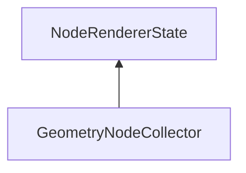

#### Inheritance Graph

## Functions

|
| --------------------------------------------------------------------------------------------------------------------------------------------------: | ------------------------------------------------------ | 
| **_constructor**()                                                                                                                                  | [ESF] new MinSG.SVS.GeometryNodeCollector()            | 
| **[getCollectedNodes](classMinSG_1_1SVS_1_1GeometryNodeCollector#classMinSG_1_1SVS_1_1GeometryNodeCollector_1ad76a0260c82631b785cedc2bbefed1f2)**() | [ESMF] Array GeometryNodeCollector.getCollectedNodes() | 
{: .nohead .nowrap1 }

