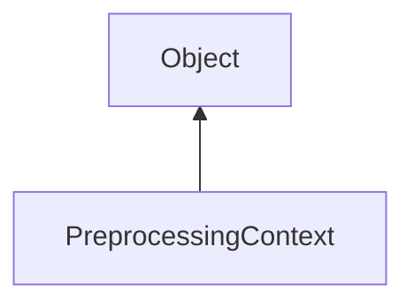

#### Inheritance Graph

## Functions

|
| ---------------------------------------------------------------------------------------------------------------------------------------------------: | ---------------------------------------------------------------------------------------------------- | 
| **_constructor**(p0, p1, p2, p3, p4, p5, p6)                                                                                                         | [ESF] new SVS.PreprocessingContext(SceneManager, FrameContext, GroupNode, Array, Number, Bool, Bool) | 
| **[getNumRemainingNodes](classMinSG_1_1SVS_1_1PreprocessingContext#classMinSG_1_1SVS_1_1PreprocessingContext_1a133363a9ac2c40f4a45cd21104e249e7)**() | [ESMF] Number PreprocessingContext.getNumRemainingNodes()                                            | 
| **[isFinished](classMinSG_1_1SVS_1_1PreprocessingContext#classMinSG_1_1SVS_1_1PreprocessingContext_1a4ebace5210f1fb515edd17e8a7c7ca57)**()           | [ESMF] Bool PreprocessingContext.isFinished()                                                        | 
| **[preprocessSingleNode](classMinSG_1_1SVS_1_1PreprocessingContext#classMinSG_1_1SVS_1_1PreprocessingContext_1a123e4b82f088d26d1f50e78d92853f79)**() | [ESMF] Void PreprocessingContext.preprocessSingleNode()                                              | 
{: .nohead .nowrap1 }

