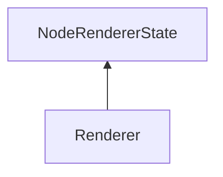

#### Inheritance Graph

## Functions

|
| -------------------------------------------------------------------------------------------------------------------------------------: | ----------------------------------------------------- | 
| **_constructor**()                                                                                                                     | [ESF] new MinSG.SVS.Renderer()                        | 
| **[disableGeometryOcclusionTest](classMinSG_1_1SVS_1_1Renderer#classMinSG_1_1SVS_1_1Renderer_1abf208bb37f7a14f66f36b29572452532)**()   | [ESMF] self Renderer.disableGeometryOcclusionTest()   | 
| **[disableSphereOcclusionTest](classMinSG_1_1SVS_1_1Renderer#classMinSG_1_1SVS_1_1Renderer_1a31122c52ea21b7c33a1869689493950e)**()     | [ESMF] self Renderer.disableSphereOcclusionTest()     | 
| **[enableGeometryOcclusionTest](classMinSG_1_1SVS_1_1Renderer#classMinSG_1_1SVS_1_1Renderer_1af77f41796a065a0df54f4103e9a7e5af)**()    | [ESMF] self Renderer.enableGeometryOcclusionTest()    | 
| **[enableSphereOcclusionTest](classMinSG_1_1SVS_1_1Renderer#classMinSG_1_1SVS_1_1Renderer_1aec8c6946e9d11f8a275ae0bd2ea72635)**()      | [ESMF] self Renderer.enableSphereOcclusionTest()      | 
| **[getInterpolationMethod](classMinSG_1_1SVS_1_1Renderer#classMinSG_1_1SVS_1_1Renderer_1a002ecb688b6ed0c4de536194ad640b91)**()         | [ESMF] Number Renderer.getInterpolationMethod()       | 
| **[isGeometryOcclusionTestEnabled](classMinSG_1_1SVS_1_1Renderer#classMinSG_1_1SVS_1_1Renderer_1af1f75747ae52c57389701bb46702c9bd)**() | [ESMF] Bool Renderer.isGeometryOcclusionTestEnabled() | 
| **[isSphereOcclusionTestEnabled](classMinSG_1_1SVS_1_1Renderer#classMinSG_1_1SVS_1_1Renderer_1a1a5ed3d2ffa327e95c231eb7c0771106)**()   | [ESMF] Bool Renderer.isSphereOcclusionTestEnabled()   | 
| **[setInterpolationMethod](classMinSG_1_1SVS_1_1Renderer#classMinSG_1_1SVS_1_1Renderer_1a5e63df5f78cb0e1f1e439e252460661f)**(p0)       | [ESMF] self Renderer.setInterpolationMethod(Number)   | 
{: .nohead .nowrap1 }

