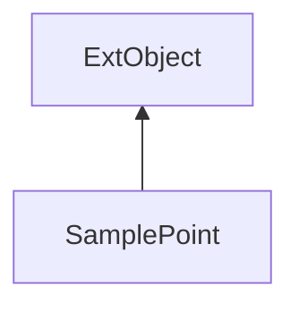

#### Inheritance Graph

## Functions

|
| ------------------------------------------------------------------------------------------------------------------------: | -------------------------------------------------- | 
| **_constructor**(p0)                                                                                                      | [ESF] new SamplePoint(Vec3)                        | 
| **[getPosition](classMinSG_1_1SVS_1_1SamplePoint#classMinSG_1_1SVS_1_1SamplePoint_1a37ce235565f1e286503333e827a25861)**() | [ESMF] Vec3 SamplePoint.getPosition()              | 
| **[getValue](classMinSG_1_1SVS_1_1SamplePoint#classMinSG_1_1SVS_1_1SamplePoint_1adcba362862cae433953af08948f1f319)**()    | [ESMF] VisibilityVector SamplePoint.getValue()     | 
| **[setValue](classMinSG_1_1SVS_1_1SamplePoint#classMinSG_1_1SVS_1_1SamplePoint_1a43b98b230aebef0dd06990b711ead32d)**(p0)  | [ESMF] self SamplePoint.setValue(VisibilityVector) | 
{: .nohead .nowrap1 }

