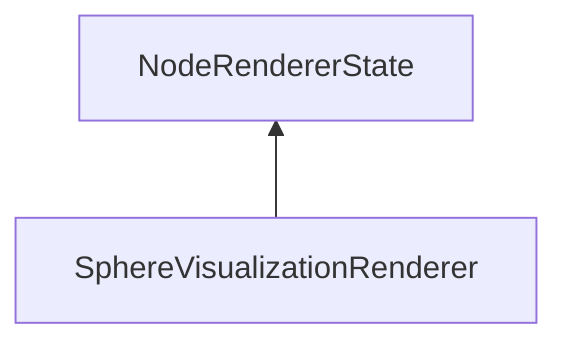

#### Inheritance Graph

## Functions

|
| -----------------: | ------------------------------------------------- | 
| **_constructor**() | [ESF] new MinSG.SVS.SphereVisualizationRenderer() | 
{: .nohead .nowrap1 }

