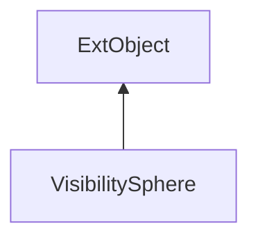

#### Inheritance Graph

## Functions

|
| -------------------------------------------------------------------------------------------------------------------------------------------------------: | ----------------------------------------------------------------------------------------------- | 
| **_constructor**(p0, p1)                                                                                                                                 | [ESF] new VisibilitySphere(Sphere, Array)                                                       | 
| **[evaluateAllSamples](classMinSG_1_1SVS_1_1VisibilitySphere#classMinSG_1_1SVS_1_1VisibilitySphere_1a9be020bc707731e17616089d9fb80a55)**(p0, p1, p2, p3) | [ESMF] self VisibilitySphere.evaluateAllSamples(FrameContext, Evaluator, CameraNodeOrtho, Node) | 
| **[getMemoryUsage](classMinSG_1_1SVS_1_1VisibilitySphere#classMinSG_1_1SVS_1_1VisibilitySphere_1a02363fee674f4d5f0be5a9cda4f20ee1)**()                   | [ESMF] Sphere VisibilitySphere.getMemoryUsage()                                                 | 
| **[getSamples](classMinSG_1_1SVS_1_1VisibilitySphere#classMinSG_1_1SVS_1_1VisibilitySphere_1aebaf3830a9b077f7cb2c44f0536cb295)**()                       | [ESMF] Array VisibilitySphere.getSamples()                                                      | 
| **[getSphere](classMinSG_1_1SVS_1_1VisibilitySphere#classMinSG_1_1SVS_1_1VisibilitySphere_1a5c9f3548ab42e6ede2817c883ece2541)**()                        | [ESMF] Sphere VisibilitySphere.getSphere()                                                      | 
| **[getTriangulationMinSGNodes](classMinSG_1_1SVS_1_1VisibilitySphere#classMinSG_1_1SVS_1_1VisibilitySphere_1a64f811d92f4acff7b18ee35115d2912d)**()       | [ESMF] Node VisibilitySphere.getTriangulationMinSGNodes()                                       | 
| **[queryValue](classMinSG_1_1SVS_1_1VisibilitySphere#classMinSG_1_1SVS_1_1VisibilitySphere_1aee1d9f2ac334b8cf21ca1adbe750c615)**(p0, p1)                 | [ESMF] VisibilityVector VisibilitySphere.queryValue(Vec3, Number)                               | 
{: .nohead .nowrap1 }

