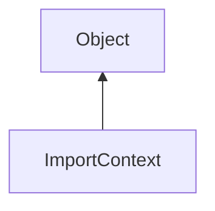

#### Inheritance Graph

## Functions

|
| --------------------------------------------------------------------------------------------------------------------------------------------------------: | -------------------------------------------------- | 
| **[addSearchPath](classMinSG_1_1SceneManagement_1_1ImportContext#classMinSG_1_1SceneManagement_1_1ImportContext_1acc3bbd449cab203bcc6b00f18e83d946)**(p0) | [ESMF] self ImportContext.addSearchPath( String ); | 
{: .nohead .nowrap1 }

