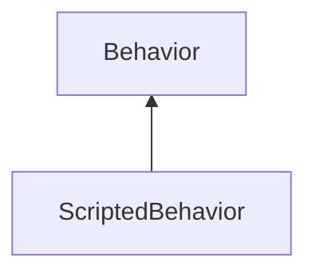

#### Inheritance Graph

## Functions

|
| ------------------------------: | ------------------------------------------------------------------------ | 
| **_constructor**()              | [ESMF] new MinSG.E_ScriptedBehavior()                                    | 
| **doBeforeInitialExecute**(p0)  | [ESMF] void MinSG.ScriptedNodeBehaviour.doBeforeInitialExecute(Status)   | 
| **doExecute**(p0)               | [ESMF] void MinSG.ScriptedNodeBehaviour.doExecute(Status)                | 
| **doFinalize**(p0)              | [ESMF] void MinSG.ScriptedNodeBehaviour.doFinalize(Status)               | 
| **doPrepareBehaviorStatus**(p0) | [ESMF] void MinSG.ScriptedNodeBehaviour.doPrepareBehaviorStatus(Status)  | 
{: .nohead .nowrap1 }

