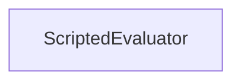

#### Inheritance Graph

## Functions

|
| ---------------------: | ----------------------------------------------------- | 
| **_constructor**([p0]) |  Evaluator new ScriptedEvaluator([mode=SINGLE_VALUE]) | 
| **beginMeasure**()     | [ESMF] void Evaluator.beginMeasure()                  | 
| **endMeasure**()       | [ESMF] void Evaluator.endMeasure()                    | 
| **getResults**()       | [ESMF] void Evaluator.getResults()                    | 
| **measure**()          | [ESMF] void Evaluator.measure()                       | 
{: .nohead .nowrap1 }

