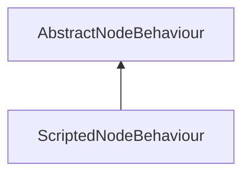

#### Inheritance Graph

## Functions

|
| -------------------: | --------------------------------------------------------------------------- | 
| **_constructor**(p0) | [ESF] new MinSG.ScriptedNodeBehaviour(Node)                                 | 
| **doExecute**()      | [ESMF] Number MinSG.ScriptedNodeBehaviour.doExecute() \note ObjectAttribute | 
| **onInit**()         | [ESMF] void MinSG.ScriptedNodeBehaviour.onInit() \note ObjectAttribute      | 
{: .nohead .nowrap1 }

