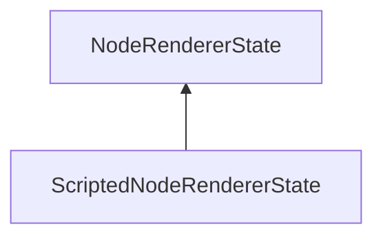

#### Inheritance Graph

## Functions

|
| -------------------------: | -------------------------------------------------------------------------------------------------- | 
| **_constructor**([p0])     | [ESF] new MinSG.ScriptedNodeRendererState([channel])                                               | 
| **displayNode**(p0, p1)    | [ESMF] void MinSG.ScriptedNodeRendererState.displayNode((Node,RenderParam) \note ObjectAttribute   | 
| **doDisableState**(p0, p1) | [ESMF] void MinSG.ScriptedNodeRendererState.doDisableState(Node,RenderParam) \note ObjectAttribute | 
| **doEnableState**(p0, p1)  | [ESMF] void MinSG.ScriptedNodeRendererState.doEnableState(Node,RenderParam) \note ObjectAttribute  | 
{: .nohead .nowrap1 }

