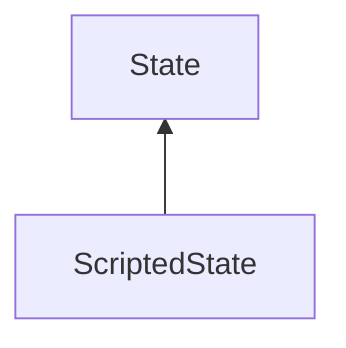

#### Inheritance Graph

## Functions

|
| -------------------------: | -------------------------------------------------------------------------------------- | 
| **_constructor**()         | [ESF] new MinSG.ScriptedState()                                                        | 
| **doDisableState**(p0, p1) | [ESMF] void MinSG.ScriptedState.doDisableState(Node,RenderParam) \note ObjectAttribute | 
| **doEnableState**(p0, p1)  | [ESMF] void MinSG.ScriptedState.doEnableState(Node,RenderParam) \note ObjectAttribute  | 
{: .nohead .nowrap1 }

