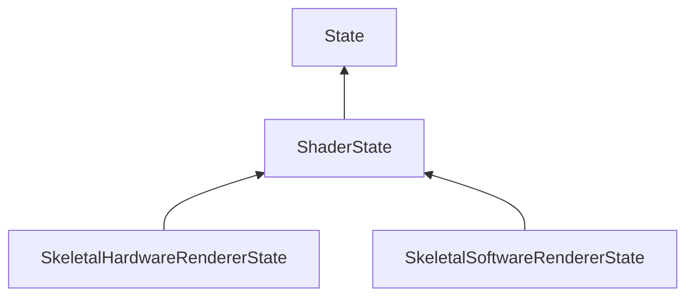

#### Inheritance Graph

## Functions

|
| --------------------------------------------------------------------------------------------------------------: | -------------------------------------------------------------------- | 
| **_constructor**([p0])                                                                                          | [ESMF] new MinSG.ShaderState(Shader s = nullptr)                     | 
| **[getShader](classMinSG_1_1ShaderState#classMinSG_1_1ShaderState_1aa8ba7d68cb0e6a254cb6aa139519f8eb)**()       | [ESMF]Shader\|void MinSG.ShaderState.getShader()                     | 
| **[getUniform](classMinSG_1_1ShaderState#classMinSG_1_1ShaderState_1af43916b364395fdb538f72284ba6cdbf)**(p0)    | [ESMF]Uniform MinSG.ShaderState.getUniform(String u)                 | 
| **[getUniforms](classMinSG_1_1ShaderState#classMinSG_1_1ShaderState_1add523030048b8e2bfa1c8e1a6566c2e1)**()     | [ESMF] Array MinSG.ShaderState.getUniforms()                         | 
| **[hasUniform](classMinSG_1_1ShaderState#classMinSG_1_1ShaderState_1a39a96b0db0cd81e9ee17578eee05b913)**(p0)    | [ESMF] new MinSG.ShaderState.hasUniform(String u)                    | 
| **[removeUniform](classMinSG_1_1ShaderState#classMinSG_1_1ShaderState_1a382421d1d3e6301e8e8eb06beda90ab0)**(p0) | [ESMF] thisEObj MinSG.ShaderState.removeUniform(String u \| Uniform) | 
| **[removeUniforms](classMinSG_1_1ShaderState#classMinSG_1_1ShaderState_1ada1510709537592c1045e894ce1c8f4e)**()  | [ESMF] thisEObj MinSG.ShaderState.removeUniforms()                   | 
| **[setShader](classMinSG_1_1ShaderState#classMinSG_1_1ShaderState_1ade1e0e0d46c7b6d1436b58ea74e3e72a)**(p0)     | [ESMF] thisEObj MinSG.ShaderState.setShader(Shader s)                | 
| **[setUniform](classMinSG_1_1ShaderState#classMinSG_1_1ShaderState_1aa35b3ef3018e1366c4406de871fe7bfe)**(p0)    | [ESMF] new MinSG.ShaderState.setUniform(Uniform u)                   | 
{: .nohead .nowrap1 }

