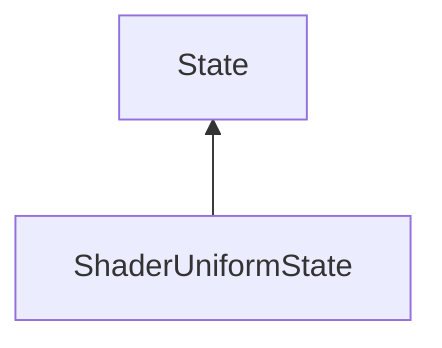

#### Inheritance Graph

## Functions

|
| ----------------------------------------------------------------------------------------------------------------------------: | --------------------------------------------------------------------------- | 
| **_constructor**()                                                                                                            | [ESMF] new MinSG.ShaderUniformState()                                       | 
| **[getUniform](classMinSG_1_1ShaderUniformState#classMinSG_1_1ShaderUniformState_1ad02ab614ae07d1f5cd772e3012a5a951)**(p0)    | [ESMF]Uniform MinSG.ShaderUniformState.getUniform(String u)                 | 
| **[getUniforms](classMinSG_1_1ShaderUniformState#classMinSG_1_1ShaderUniformState_1a377f13f2c9c537815577adf7ee2dffa5)**()     | [ESMF] Array MinSG.ShaderUniformState.getUniforms()                         | 
| **[hasUniform](classMinSG_1_1ShaderUniformState#classMinSG_1_1ShaderUniformState_1a98072d9a2c304d0371b59bd70807b69e)**(p0)    | [ESMF] new MinSG.ShaderUniformState.hasUniform(String u)                    | 
| **[removeUniform](classMinSG_1_1ShaderUniformState#classMinSG_1_1ShaderUniformState_1aec21791d5ae4af073ed1da4662ffe273)**(p0) | [ESMF] thisEObj MinSG.ShaderUniformState.removeUniform(String u \| Uniform) | 
| **[removeUniforms](classMinSG_1_1ShaderUniformState#classMinSG_1_1ShaderUniformState_1ace1b646ea68905fe27d62195b6b7a357)**()  | [ESMF] thisEObj MinSG.ShaderUniformState.removeUniforms()                   | 
| **[setUniform](classMinSG_1_1ShaderUniformState#classMinSG_1_1ShaderUniformState_1a3c3682570218b3ca81f8ecfeea5caaeb)**(p0)    | [ESMF] new MinSG.ShaderUniformState.setUniform(Uniform u)                   | 
{: .nohead .nowrap1 }

