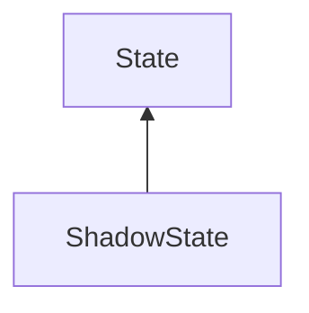

#### Inheritance Graph

## Functions

|
| ----------------------------------------------------------------------------------------------------------: | ------------------------------------------------------ | 
| **_constructor**(p0)                                                                                        | [ESMF] ShadowState new ShadowState(Number textureSize) | 
| **[getLight](classMinSG_1_1ShadowState#classMinSG_1_1ShadowState_1a39761bf09f4b93c3c524a339b55cd32f)**()    | [ESMF] LightNode ShadowState.getLight()                | 
| **[isStatic](classMinSG_1_1ShadowState#classMinSG_1_1ShadowState_1a7b1d134dbc65868d6d02e10d04cca97d)**()    | [ESMF] Bool ShadowState.isStatic()                     | 
| **[setLight](classMinSG_1_1ShadowState#classMinSG_1_1ShadowState_1adf30c805b1bc996e8e217b5897c44ca5)**(p0)  | [ESMF] self ShadowState.setLight(LightNode)            | 
| **[setStatic](classMinSG_1_1ShadowState#classMinSG_1_1ShadowState_1a300c178caef614788db825c99bd8d9a8)**(p0) | [ESMF] self ShadowState.setStatic(Bool)                | 
| **[update](classMinSG_1_1ShadowState#classMinSG_1_1ShadowState_1a1626e35fc1a82d4afa5cc0c3a05b1d81)**()      | [ESMF] self ShadowState.update()                       | 
{: .nohead .nowrap1 }

