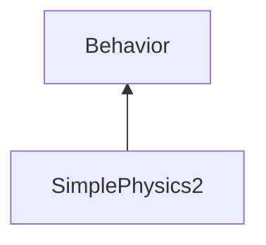

#### Inheritance Graph

```mermaid
graph BT
	SimplePhysics2
	SimplePhysics2 --> Behavior
	click SimplePhysics2 "escript_type_MinSG_SimplePhysics2"
	click Behavior "escript_type_MinSG_Behavior"
```

## Functions

|
| -----------------: | ----------------------------------- | 
| **_constructor**() | [ESMF] new MinSG.E_SimplePhysics2() | 
{: .nohead .nowrap1 }

