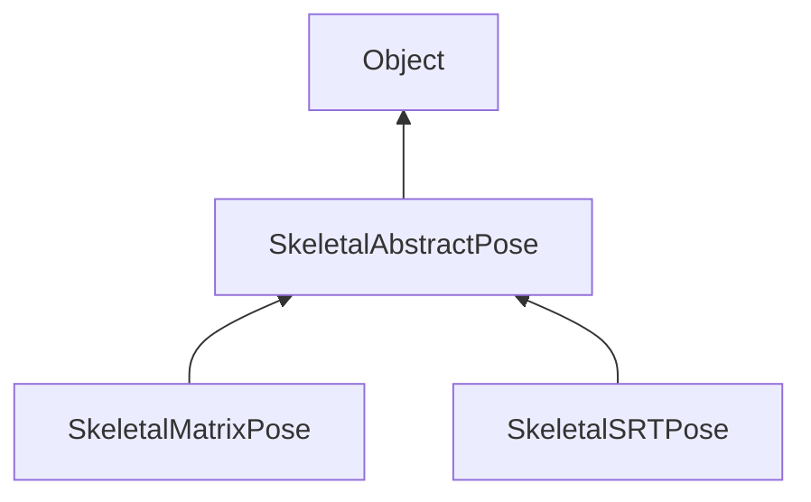

#### Inheritance Graph

## Attributes

|
| -------------------------------------------------------------------------------------------------------: | -- | 
| **[BEZIER](classMinSG_1_1AbstractPose#classMinSG_1_1AbstractPose_1a390b2c766f75037f50d744322a10ceda)**   |  | 
| **[CONSTANT](classMinSG_1_1AbstractPose#classMinSG_1_1AbstractPose_1a37b2a7c68005787f434dcfc7097a44f3)** |  | 
| **[LINEAR](classMinSG_1_1AbstractPose#classMinSG_1_1AbstractPose_1a716131af9a8f3b55aefc9a056935b497)**   |  | 
{: .nohead .nowrap1 }

## Functions

|
| -----------------------------------------------------------------------------------------------------------------------------: | -------------------------------------------------------------------------------------------------------------------------- | 
| **_constructor**()                                                                                                             | [ESMF] new AbstractPose()                                                                                                  | 
| **[addValue](classMinSG_1_1AbstractPose#classMinSG_1_1AbstractPose_1a390ed1da739d625729f313c8f9a1af09)**(p0, p1 [, p2 [, p3]]) | [ESMF] void SkeletalAbstractPose.addValue(Matrix4x4 value, float time, int interpolationType=LINEAR)                       | 
| **[getName](classMinSG_1_1AbstractJoint#classMinSG_1_1AbstractJoint_1afa617ed8801b14b4ef5e8682b5de5d2d)**()                    |                                                                                                                            | 
| **getNode**()                                                                                                                  |                                                                                                                            | 
| **[getTimeline](classMinSG_1_1AbstractPose#classMinSG_1_1AbstractPose_1a50d29e1b0d87753dec316b7bab009a10)**()                  |                                                                                                                            | 
| **getValues**()                                                                                                                |                                                                                                                            | 
| **[removeValue](classMinSG_1_1AbstractPose#classMinSG_1_1AbstractPose_1ad470a34081199bcc4b5da5f11199eecc)**(p0)                |                                                                                                                            | 
| **restart**()                                                                                                                  |                                                                                                                            | 
| **[setTimeline](classMinSG_1_1AbstractPose#classMinSG_1_1AbstractPose_1ad5ed0d2402abbd8eb4490734ad4c5f51)**(p0)                |                                                                                                                            | 
| **[setValues](classMinSG_1_1AbstractPose#classMinSG_1_1AbstractPose_1aecc9597929cac633b9d3d24789586be4)**(p0, p1 [, p2])       | [ESMF] bool SkeletalAbstractPose.addValues(Array[Matrix4x4] value, Array[float] time, Array[int] interpolationType=LINEAR) | 
| **[update](classMinSG_1_1AbstractPose#classMinSG_1_1AbstractPose_1a12bef297207f4b9b6cfb6e02155b6602)**(p0)                     |                                                                                                                            | 
{: .nohead .nowrap1 }

