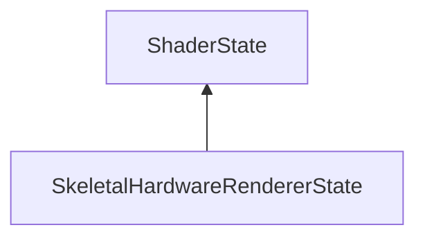

#### Inheritance Graph

## Functions

|
| ----------------------------------------------------------------------------------------------------------------------------------------------------: | -- | 
| **[clone](classMinSG_1_1SkeletalHardwareRendererState#classMinSG_1_1SkeletalHardwareRendererState_1a2d481fe12963e1cbdb860dabc4d46912)**()             |  | 
| **[getDebugJointId](classMinSG_1_1SkeletalAbstractRendererState#classMinSG_1_1SkeletalAbstractRendererState_1abc7e050127c35330bdba08e84de41ef6)**()   |  | 
| **[setDebugJointId](classMinSG_1_1SkeletalAbstractRendererState#classMinSG_1_1SkeletalAbstractRendererState_1a1eacca0f59a2224c2a560ef3e9becb76)**(p0) |  | 
{: .nohead .nowrap1 }

