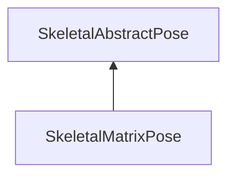

#### Inheritance Graph

## Functions

|
| -----------------------------: | ------------------------------------------------ | 
| **_constructor**(p0)           | [ESMF] new MinSG.SkeletalMatrixPose(E_JointNode) | 
| **updateValueAtIndex**(p0, p1) |                                                  | 
{: .nohead .nowrap1 }

