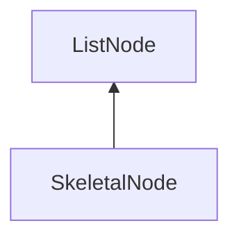

#### Inheritance Graph

## Functions

|
| -------------------------------------------------------------------------------------------------------------------------: | ----------------------------------- | 
| **_constructor**()                                                                                                         | [ESMF] new MinSG.E_SkeletalNode( )	 | 
| **[addAnimation](classMinSG_1_1SkeletalNode#classMinSG_1_1SkeletalNode_1af466c4582d2628a7febf15f29f0b3201)**(p0)           |                                     | 
| **[attachObject](classMinSG_1_1SkeletalNode#classMinSG_1_1SkeletalNode_1a56fa7b47db721c5068e7aefaf7ef509e)**(p0, p1)       |                                     | 
| **[clearAnimation](classMinSG_1_1SkeletalNode#classMinSG_1_1SkeletalNode_1a5b3909ebed0193150c9141b56a1b70b8)**(p0, p1)     |                                     | 
| **[clearAnimations](classMinSG_1_1SkeletalNode#classMinSG_1_1SkeletalNode_1a510838171bc8755d742910d76ec11680)**(p0)        |                                     | 
| **[detachObject](classMinSG_1_1SkeletalNode#classMinSG_1_1SkeletalNode_1ad2b191642ac2d3d2257b0f3f33a17a1c)**(p0, p1)       |                                     | 
| **[getAnimation](classMinSG_1_1SkeletalNode#classMinSG_1_1SkeletalNode_1ad610ae9d0bca75cd414303b30862c167)**(p0)           |                                     | 
| **[getAnimationCount](classMinSG_1_1SkeletalNode#classMinSG_1_1SkeletalNode_1ac3134bbacf3e03ef56a7aa3552e1c5e6)**()        |                                     | 
| **[getAnimationNames](classMinSG_1_1SkeletalNode#classMinSG_1_1SkeletalNode_1aea8ebd8834191ae5e092622d24516712)**()        |                                     | 
| **[getAnimations](classMinSG_1_1SkeletalNode#classMinSG_1_1SkeletalNode_1aef2c5a20b849d4cdaee1012a23ddff02)**()            |                                     | 
| **[hasAnimation](classMinSG_1_1SkeletalNode#classMinSG_1_1SkeletalNode_1a7a0e15b5e8f818f91e0e61ffc5188f98)**(p0)           |                                     | 
| **[printAnimationNames](classMinSG_1_1SkeletalNode#classMinSG_1_1SkeletalNode_1aed66a5b2da04b8ac42004b104c32a65d)**()      |                                     | 
| **separateAnimations**(p0, p1, p2, p3)                                                                                     |                                     | 
| **[setStartAnimation](classMinSG_1_1SkeletalNode#classMinSG_1_1SkeletalNode_1af6dbbd20434fbc16906c46cb6349b42e)**(p0)      |                                     | 
| **[splitAnimation](classMinSG_1_1SkeletalNode#classMinSG_1_1SkeletalNode_1af6f105e083fdf5bad959126c6d18ca1b)**(p0, p1, p2) |                                     | 
{: .nohead .nowrap1 }

