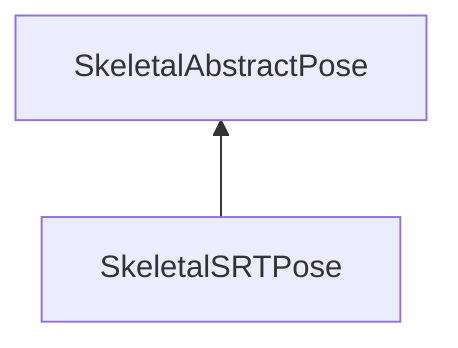

#### Inheritance Graph

## Functions

|
| -------------------: | -------------------------------------------------- | 
| **_constructor**(p0) | [ESMF] new MinSG.SkeletalSRTPose(E_JointNode node) | 
{: .nohead .nowrap1 }

