#### Inheritance Graph

```mermaid
graph BT
	State
	State --> Object
	Collector --> State
	AlphaTestState --> State
	BudgetAnnotationState --> State
	CHCRenderer --> State
	GroupState --> State
	HOMRenderer --> State
	LightingState --> State
	MirrorState --> State
	NaiveOccRenderer --> State
	NodeRendererState --> State
	OccludeeRenderer --> State
	PVSRenderer --> State
	PointParameterState --> State
	PolygonModeState --> State
	ScriptedState --> State
	ShaderState --> State
	ShaderUniformState --> State
	ShadowState --> State
	TextureState --> State
	TreeVisualization --> State
	click State "escript_type_MinSG_State"
	click Object "escript_type_Object"
	click Collector "escript_type_MinSG_PipelineStatistics_Collector"
	click AlphaTestState "escript_type_MinSG_AlphaTestState"
	click BudgetAnnotationState "escript_type_MinSG_BudgetAnnotationState"
	click CHCRenderer "escript_type_MinSG_CHCRenderer"
	click GroupState "escript_type_MinSG_GroupState"
	click HOMRenderer "escript_type_MinSG_HOMRenderer"
	click LightingState "escript_type_MinSG_LightingState"
	click MirrorState "escript_type_MinSG_MirrorState"
	click NaiveOccRenderer "escript_type_MinSG_NaiveOccRenderer"
	click NodeRendererState "escript_type_MinSG_NodeRendererState"
	click OccludeeRenderer "escript_type_MinSG_OccludeeRenderer"
	click PVSRenderer "escript_type_MinSG_PVSRenderer"
	click PointParameterState "escript_type_MinSG_PointParameterState"
	click PolygonModeState "escript_type_MinSG_PolygonModeState"
	click ScriptedState "escript_type_MinSG_ScriptedState"
	click ShaderState "escript_type_MinSG_ShaderState"
	click ShaderUniformState "escript_type_MinSG_ShaderUniformState"
	click ShadowState "escript_type_MinSG_ShadowState"
	click TextureState "escript_type_MinSG_TextureState"
	click TreeVisualization "escript_type_MinSG_TreeVisualization"
```

## Functions

|
| ---------------------------------------------------------------------------------------------------------------: | ------------------------------------------------------------------- | 
| **[activate](classMinSG_1_1State#classMinSG_1_1State_1a56a6b355decef2ad31134934cfbe4a0d)**()                     | [ESMF] thisEObj MinSG.State.activate()                              | 
| **[deactivate](classMinSG_1_1State#classMinSG_1_1State_1a2b1da8f1efb8e7c8a7d3df3972ef81e7)**()                   | [ESMF] thisEObj MinSG.State.deactivate()                            | 
| **[disableState](classMinSG_1_1State#classMinSG_1_1State_1ad197bf98b76fb732458d9f27c3f63ddd)**(p0 [, p1 [, p2]]) | [ESMF] thisEObj MinSG.State.disableState(FrameContext, Node, flags) | 
| **[enableState](classMinSG_1_1State#classMinSG_1_1State_1a8b9bf6493ba8c6c48f97358d2de9b68e)**(p0 [, p1 [, p2]])  | [ESMF] thisEObj MinSG.State.enableState(FrameContext, Node, flags)  | 
| **[getRenderingLayers](classMinSG_1_1State#classMinSG_1_1State_1a4f41c87e631b910bb952551ed9028e27)**()           | [ESMF] Number MinSG.State.getRenderingLayers()	                     | 
| **getStateAttribute**(p0)                                                                                        | [ESF] Object MinSG.State.getStateAttribute(String key)              | 
| **getStateAttributes**()                                                                                         | [ESMF] Map MinSG.State.getStateAttributes()                         | 
| **[isActive](classMinSG_1_1State#classMinSG_1_1State_1af7586bd5019c4841d89473073d3d417e)**()                     | [ESMF] Bool MinSG.State.isActive()	                                 | 
| **[isTempState](classMinSG_1_1State#classMinSG_1_1State_1a3179c0378a1dad714df444b65b019d0a)**()                  | [ESMF] Bool MinSG.State.isTempState()	                              | 
| **[setRenderingLayers](classMinSG_1_1State#classMinSG_1_1State_1ab7ac493c1e611d54f7327a2954bcc84d)**(p0)         | [ESMF] thisEObj MinSG.State.setRenderingLayers(Number)              | 
| **setStateAttribute**(p0, p1)                                                                                    | [ESF] thisEObj MinSG.State.setStateAttribute(string key,value)      | 
| **[setTempState](classMinSG_1_1State#classMinSG_1_1State_1a87e7adf5af8e9fb6b002048f0a80ed74)**(p0)               | [ESMF] thisEObj MinSG.State.setTempState(bool)                      | 
| **[testRenderingLayer](classMinSG_1_1State#classMinSG_1_1State_1ad7ce5e0e7bdd41436c740ba261b13b44)**(p0)         | [ESMF] bool MinSG.State.testRenderingLayer(Number)                  | 
| **unsetStateAttribute**(p0)                                                                                      | [ESF] thisEObj MinSG.State.unsetStateAttribute(string key)          | 
{: .nohead .nowrap1 }

