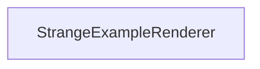

#### Inheritance Graph

## Functions

|
| -----------------: | -------------------------------------------- | 
| **_constructor**() | [ESMF] new MinSG.StrangeExampleRenderer()    | 
{: .nohead .nowrap1 }

