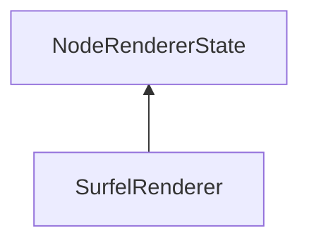

#### Inheritance Graph

## Functions

|
| ---------------------------------------------------------------------------------------------------------------------------------------------------------: | -------------------------------- | 
| **_constructor**()                                                                                                                                         | [ESF] new MinSG.SurfelRenderer() | 
| **[addSurfelStrategy](classMinSG_1_1BlueSurfels_1_1SurfelRenderer#classMinSG_1_1BlueSurfels_1_1SurfelRenderer_1aa37bf770c55ebdca831659c017d74af6)**(p0)    |                                  | 
| **[clearSurfelStrategies](classMinSG_1_1BlueSurfels_1_1SurfelRenderer#classMinSG_1_1BlueSurfels_1_1SurfelRenderer_1a52dae7fad4bcd7492c568525f2db47d1)**()  |                                  | 
| **[getSurfelStrategies](classMinSG_1_1BlueSurfels_1_1SurfelRenderer#classMinSG_1_1BlueSurfels_1_1SurfelRenderer_1aa537a3cfd12fcd659763801aad6ed8e9)**()    |                                  | 
| **[removeSurfelStrategy](classMinSG_1_1BlueSurfels_1_1SurfelRenderer#classMinSG_1_1BlueSurfels_1_1SurfelRenderer_1af28df5f3856d58d61132130c037cb5dc)**(p0) |                                  | 
{: .nohead .nowrap1 }

