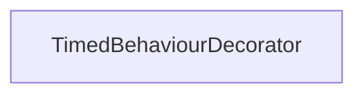

#### Inheritance Graph

## Functions

|
| --------------------------------------------------------------------------------------------------------------------------------------------: | --------------------------------------------------------------------- | 
| **_constructor**(p0 [, p1 [, p2]])                                                                                                            | new TimedBehaviourDecorator( AbstractBehaviour, startTime, relative ) | 
| **[getStartTime](classMinSG_1_1TimedBehaviourDecorator#classMinSG_1_1TimedBehaviourDecorator_1a377b15d6e0a99eb2f0ca389177e7480e)**()          | Int TimedBehaviourDecorator.getStartTime()                            | 
| **[setStartTime](classMinSG_1_1TimedBehaviourDecorator#classMinSG_1_1TimedBehaviourDecorator_1a51b4c12db417a2f908535239207cc6b0)**(p0 [, p1]) | self TimedBehaviourDecorator.setStartTime(Number, Bool)               | 
{: .nohead .nowrap1 }

