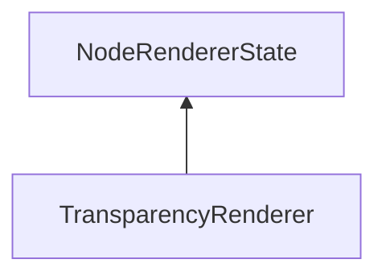

#### Inheritance Graph

## Functions

|
| -------------------------------------------------------------------------------------------------------------------------------------------: | ---------------------------------------------- | 
| **_constructor**()                                                                                                                           | [ESF] new MinSG.TransparencyRenderer()         | 
| **[getUsePremultipliedAlpha](classMinSG_1_1TransparencyRenderer#classMinSG_1_1TransparencyRenderer_1afd30fa9abea465658a2f9497892f7379)**()   | [ESMF] Bool getUsePremultipliedAlpha()         | 
| **[setUsePremultipliedAlpha](classMinSG_1_1TransparencyRenderer#classMinSG_1_1TransparencyRenderer_1a4c18fe63cf4a1afd3c9cd6ba991c736d)**(p0) | [ESMF] thisEObj setUsePremultipliedAlpha(Bool) | 
{: .nohead .nowrap1 }

