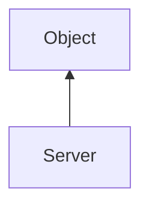

#### Inheritance Graph

## Functions

|
| -------------------------------------------------------------------------------------------------------------------------------: | ---------------------------------------------- | 
| **_constructor**(p0, p1)                                                                                                         | [ESF] new Server(SceneManager,DataBroadcaster) | 
| **[initNodeObserver](classMinSG_1_1TreeSync_1_1Server#classMinSG_1_1TreeSync_1_1Server_1a634185931244d70cb416ee0f6d5180b3)**(p0) | [ESMF] self Server.initNodeObserver(Node)      | 
{: .nohead .nowrap1 }

