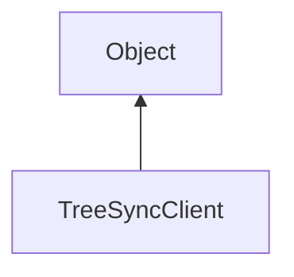

#### Inheritance Graph

## Functions

|
| --------------------------------------------------------------------------------------------------------------------------------------: | ------------------------------------------------------- | 
| **_constructor**(p0)                                                                                                                    | [ESF] new TreeSyncClient(Util::Network::DataConnection) | 
| **[execute](classMinSG_1_1TreeSync_1_1TreeSyncClient#classMinSG_1_1TreeSync_1_1TreeSyncClient_1a54e4bf063755876abc1eb425727fa0b6)**(p0) | [ESMF] self TreeSyncClient.execute(SceneManager)        | 
{: .nohead .nowrap1 }

