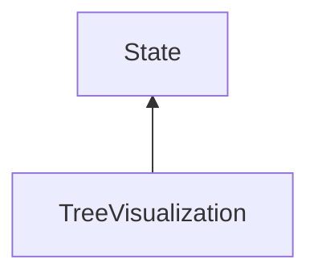

#### Inheritance Graph

## Functions

|
| ---------------------------------------------------------------------------------------------------------------------------------------------------------------------: | ---------------------------------------------------------- | 
| **_constructor**()                                                                                                                                                     | [ESF] TreeVisualization new TreeVisualization()            | 
| **[getDrawDepth](classMinSG_1_1TriangleTrees_1_1TreeVisualization#classMinSG_1_1TriangleTrees_1_1TreeVisualization_1af53892fbb22109d32e430fd70285d5aa)**()             | [ESMF] Number TreeVisualization.getDrawDepth()             | 
| **[getShowBoundingBoxes](classMinSG_1_1TriangleTrees_1_1TreeVisualization#classMinSG_1_1TriangleTrees_1_1TreeVisualization_1a138573ba7787deb352dd285c2028e11f)**()     | [ESMF] Bool TreeVisualization.getShowBoundingBoxes()       | 
| **[getShowLines](classMinSG_1_1TriangleTrees_1_1TreeVisualization#classMinSG_1_1TriangleTrees_1_1TreeVisualization_1a31be4cd3e15a8e4b33676771db2528e3)**()             | [ESMF] Bool TreeVisualization.getShowLines()               | 
| **[getShowSplittingPlanes](classMinSG_1_1TriangleTrees_1_1TreeVisualization#classMinSG_1_1TriangleTrees_1_1TreeVisualization_1a239b09aff7fc7e1bbb89258ffc9f885c)**()   | [ESMF] Bool TreeVisualization.getShowSplittingPlanes()     | 
| **[setDrawDepth](classMinSG_1_1TriangleTrees_1_1TreeVisualization#classMinSG_1_1TriangleTrees_1_1TreeVisualization_1a8af45ae972e30e2811c7c348c81ca534)**(p0)           | [ESMF] self TreeVisualization.setDrawDepth(Number)         | 
| **[setShowBoundingBoxes](classMinSG_1_1TriangleTrees_1_1TreeVisualization#classMinSG_1_1TriangleTrees_1_1TreeVisualization_1a13115e072467ad1eb5d1bf29947a6e30)**(p0)   | [ESMF] self TreeVisualization.setShowBoundingBoxes(Bool)   | 
| **[setShowLines](classMinSG_1_1TriangleTrees_1_1TreeVisualization#classMinSG_1_1TriangleTrees_1_1TreeVisualization_1afbe2af7acd5d1c02f8665f6badf82b2a)**(p0)           | [ESMF] self TreeVisualization.setShowLines(Bool)           | 
| **[setShowSplittingPlanes](classMinSG_1_1TriangleTrees_1_1TreeVisualization#classMinSG_1_1TriangleTrees_1_1TreeVisualization_1af027b46d251bc7ab3c13a5ede349ba9f)**(p0) | [ESMF] self TreeVisualization.setShowSplittingPlanes(Bool) | 
{: .nohead .nowrap1 }

